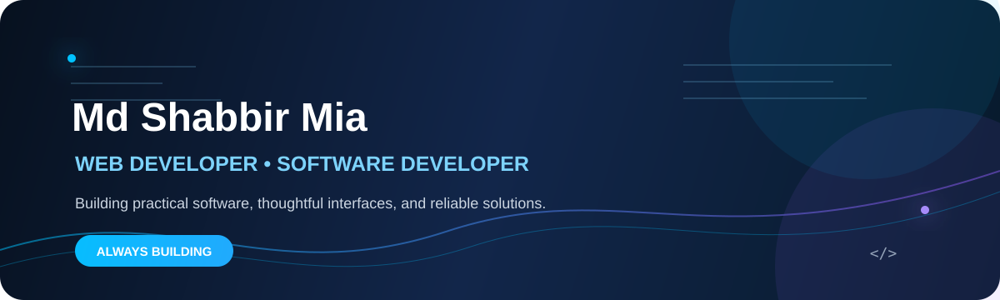

<!-- Professional GitHub Profile README for shabbirmai124 -->

  
    
  
  

    
    
    
  

  

---

## 👋 Hello, I'm Md Shabbir Mia

I am a **Web Developer and Software Developer** focused on creating useful, maintainable applications. I enjoy transforming complex problems into clear solutions, designing accessible interfaces, and improving projects through steady iteration.

- 🌐 Building my skills in modern **web development** and responsive user experiences.
- 🐍 Developing practical projects with **Python** and structured applications with **C**.
- ⚙️ Interested in automation, software design, data handling, testing, and clean code.
- 📚 Learning through hands-on development, documentation, feedback, and collaboration.
- 🤝 Open to meaningful projects, learning opportunities, and constructive feedback.

## 🛠️ Skills & Technologies

  

| Category | Technologies |
| --- | --- |
| **Programming** | C, Python |
| **Web development** | HTML, CSS, JavaScript |
| **Tools** | Git, GitHub, Visual Studio Code |
| **Exploring** | Kotlin, React, responsive design, automation |
| **Engineering interests** | Clean code, algorithms, accessibility, documentation, testing |

---

## 🚀 Featured Projects

<table>
  <tr>
    <td width="50%" valign="top">
      <h3>🤝 <a href="https://github.com/shabbirmai124/SyncSpace">SyncSpace</a></h3>
      
Unified team collaboration and mobile-platform project designed to bridge structured enterprise productivity with engaging social collaboration.

      
      
    </td>
    <td width="50%" valign="top">
      <h3>📚 <a href="https://github.com/shabbirmai124/TopperTrack">TopperTrack</a></h3>
      
An academic tracking project focused on organizing progress, performance insights, and useful student workflows.

      
    </td>
  </tr>
  <tr>
    <td width="50%" valign="top">
      <h3>🐦 <a href="https://github.com/shabbirmai124/flappy-bird-pro.github.io">Flappy Bird Pro</a></h3>
      
A browser-based game project demonstrating interactive web development and frontend experimentation.

      
      
    </td>
    <td width="50%" valign="top">
      <h3>🧠 <a href="https://github.com/shabbirmai124/Deep-Multimodal-Hand-Gesture-Recognition-using-Attention-Augmented-CNN">Hand Gesture Recognition</a></h3>
      
Deep multimodal hand-gesture recognition project using an attention-augmented CNN approach.

      
      
    </td>
  </tr>
  <tr>
    <td width="50%" valign="top">
      <h3>✅ <a href="https://github.com/shabbirmai124/Spell-Checker-Analyser-">Spell Checker Analyser</a></h3>
      
A C project exploring spell-checking and text-analysis concepts.

      
    </td>
    <td width="50%" valign="top">
      <h3>🔐 <a href="https://github.com/shabbirmai124/FingerPrintVoting-System">Fingerprint Voting System</a></h3>
      
Python command-line simulation with registration, hashed simulated identifiers, duplicate-vote prevention, and result reporting.

      
    </td>
  </tr>
</table>

### More projects

- 🎫 [Event Management](https://github.com/shabbirmai124/Event-Managment)
- 🏋️ [Gym Management System](https://github.com/shabbirmai124/Gym_management_System)
- 🛒 [Market Visit Problem](https://github.com/shabbirmai124/Market_Visit_Problem)
- 🗂️ [View all repositories](https://github.com/shabbirmai124?tab=repositories)

---

## 📈 GitHub Activity

  
  

 

  

---

## 🎯 Current Goals

- Build complete, well-documented web and software projects.
- Strengthen data structures, algorithms, clean-code, and testing practices.
- Improve responsive UI design and modern web-development skills.
- Learn from collaboration and contribute to practical open-source work.

## 📫 Let's Connect

  
Have an idea, feedback, or an interesting project? Feel free to reach out.

  
    
  <a href="https://github.com/shabbirmai124">GitHub Profile</a>

---

  
    
  Designed with purpose · Built with curiosity · Evolving every day

